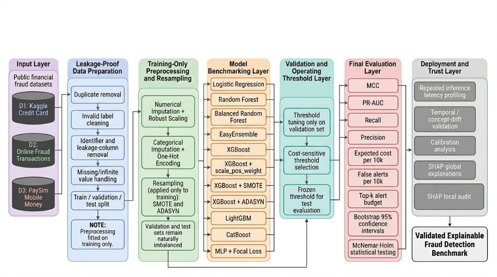

# 📊 Multi-Dataset Fraud Detection Benchmark

## A Leakage-Controlled Framework for Explainable and Interpretable Financial Fraud Detection Using Tree-Based Ensembles and Neural Networks

<div align="center">


**[📊 Experimental Results](#-experimental-results)** •
**[🔬 Saved Outputs](results/)** •
**[📓 Reproduction Notebook](notebooks/Code.ipynb)**

</div>

---

## 📖 Abstract

Financial fraud benchmarks are sensitive to class imbalance, data leakage, threshold selection, and the relative cost of missed fraud and false alerts. This repository evaluates twelve conventional and neural-network configurations across three public fraud datasets using a leakage-controlled workflow. Data splitting is completed before fitted preprocessing, resampling is restricted to the training partition, validation data are used to select operating thresholds, and the held-out test partition is reserved for final evaluation.

The results do not identify one model as the winner for every dataset and objective. LightGBM leads several discrimination measures, XGBoost records the highest MCC on D2, and XGBoost + ADASYN gives the lowest D1 expected cost under the stated cost setting. The repository also reports bootstrap confidence intervals, exact McNemar tests with Holm correction, alert-budget performance, repeated batched inference latency, calibration, chronological validation, feature-drift diagnostics, and SHAP explanations.

---

## 🚀 Workflow Overview

The experimental workflow follows a leakage-controlled pipeline:

<div align="center">

</div>

**Pipeline Steps:**

| Layer | Description |
|-------|-------------|
| **Input Layer** | Public financial fraud datasets: D1 (Kaggle Credit Card), D2 (Online Fraud Transactions), D3 (PaySim Mobile Money) |
| **Leakage-Proof Data Preparation** | Duplicate removal, invalid label cleaning, identifier and leakage-column removal, missing/infinite value handling, Train/Validation/Test split *(Preprocessing fitted on training only)* |
| **Training-Only Preprocessing & Resampling** | Numerical Imputation + Robust Scaling, Categorical Imputation + One-Hot Encoding, Resampling (SMOTE/ADASYN) applied only to training *(Validation and test sets remain naturally imbalanced)* |
| **Model Benchmarking Layer** | Logistic Regression, Random Forest, Balanced Random Forest, EasyEnsemble, XGBoost, XGBoost + scale_pos_weight, XGBoost + SMOTE, XGBoost + ADASYN, LightGBM, CatBoost, MLP + Focal Loss, MLP + Focal + SMOTE |
| **Validation & Operating Threshold Layer** | Threshold tuning only on validation set, Cost-sensitive threshold selection, Frozen threshold for test evaluation |
| **Final Evaluation Layer** | PR-AUC, Recall, Precision, Expected cost per 10k, False alerts per 10k, Top-k alert budget, Bootstrap 95% confidence intervals, McNemar-Holm statistical testing |
| **Deployment & Trust Layer** | Repeated inference latency profiling, Temporal/concept-drift validation, Calibration analysis, SHAP global explanations, SHAP local audit |
| **Output** | Validated Explainable Fraud Detection Benchmark |

---

## 🎯 Key Contributions

| # | Contribution |
|---|-------------|
| 1️⃣ | **Multi-Dataset Benchmark**: Evaluation across 3 fraud datasets with varying characteristics |
| 2️⃣ | **Leakage-Controlled Workflow**: Strict train/validation/test separation with preprocessing fitted on training only |
| 3️⃣ | **Comprehensive Models**: 12 evaluated configurations including XGBoost, LightGBM, CatBoost, Random Forest, and MLP with Focal Loss |
| 4️⃣ | **Resampling Strategies**: SMOTE, ADASYN, and cost-sensitive threshold tuning |
| 5️⃣ | **Statistical Rigor**: exact McNemar testing with Holm correction, bootstrap 95% confidence intervals, and chronological validation |
| 6️⃣ | **Explainability**: SHAP global and local interpretations |
| 7️⃣ | **Deployment Metrics**: Inference latency profiling and top-k alert budget analysis |

---

## 📊 Datasets

The benchmark uses three publicly available fraud detection datasets with varying fraud rates and feature spaces:

| Dataset | Source File | Original Rows | Rows Used | Fraud Cases | Fraud Rate | Features |
|---------|-------------|---------------|-----------|-------------|------------|----------|
| **D1: Kaggle Credit Card** | `creditcard.csv` | 283,726 | 283,726 | 473 | 0.1667% | 30 |
| **D2: Online Fraud** | `fraudTest.csv` | 555,719 | 300,000 | 2,145 | 0.7150% | 769 |
| **D3: PaySim Mobile Money** | `PS.csv` | 5,840,045 | 200,000 | 4,497 | 2.2485% | 11 |

### 📥 Dataset Sources

| Dataset | Source | Link |
|---------|--------|------|
| **Kaggle Credit Card** | Kaggle | [creditcardfraud](https://www.kaggle.com/datasets/mlg-ulb/creditcardfraud) |
| **Online Transaction Fraud** | Kaggle | [fraud-detection](https://www.kaggle.com/datasets/kartik2112/fraud-detection) |
| **PaySim Mobile Money** | Kaggle | [paysim1](https://www.kaggle.com/datasets/ealaxi/paysim1) |

---

## 🧠 Models Evaluated

### Conventional and Ensemble Models

| Model | Training Source | Description |
|-------|----------------|-------------|
| **Logistic Regression** | Original | Linear baseline with class weighting |
| **XGBoost** | Original | Gradient boosting with histogram-based training |
| **XGBoost + SMOTE** | SMOTE | XGBoost with SMOTE oversampling |
| **XGBoost + ADASYN** | ADASYN | XGBoost with ADASYN oversampling |
| **XGBoost scale_pos_weight** | Original | XGBoost with scale_pos_weight balancing |
| **LightGBM** | Original | LightGBM with class_weight balancing |
| **CatBoost** | Original | CatBoost with auto_class_weights |
| **Balanced Random Forest** | Original | Random Forest with balanced subsampling |
| **EasyEnsemble** | Original | Ensemble of balanced bootstrapped classifiers |
| **Random Forest** | Original | Random Forest with balanced subsampling |

### Deep Learning

| Model | Training Source | Description |
|-------|----------------|-------------|
| **MLP + Focal Loss** | Original | 3-layer MLP with Focal Loss |
| **MLP + Focal + SMOTE** | SMOTE | MLP with Focal Loss + SMOTE |

---

## 🏆 Experimental Results

No single configuration leads on every dataset and objective. The principal results are summarized below.

| Dataset | MCC Leader | PR AUC Leader | Cost Observation |
|---------|------------|---------------|------------------|
| **D1** | LightGBM: 0.8295 | LightGBM: 0.8197 | XGBoost + ADASYN: 305.40 per 10,000, the lowest among all evaluated configurations |
| **D2** | XGBoost: 0.6474 | LightGBM: 0.9227 | LightGBM: 394.50 per 10,000, below XGBoost and XGBoost + SMOTE |
| **D3** | LightGBM: 0.9364 | LightGBM: 0.9904 | XGBoost: 270.25 per 10,000 among the three principal boosting configurations |

Expected cost uses a false-negative cost of 100 and a false-positive cost of 1. In the saved outputs, PR AUC is calculated with average precision.

### Selected XGBoost + SMOTE Results

| Dataset | Threshold | Recall | Precision | MCC | ROC-AUC | PR-AUC | False Alerts /10k | Missed Frauds /10k | Expected Cost /10k |
|---------|-----------|--------|-----------|-----|---------|--------|-------------------|-------------------|-------------------|
| **D1 (Kaggle CC)** | 0.74 | 0.800 | 0.745 | 0.772 | 0.968 | 0.801 | 4.58 | 3.35 | 339.41 |
| **D2 (Online Fraud)** | 0.07 | 0.958 | 0.237 | 0.470 | 0.994 | 0.829 | 220.83 | 3.00 | 520.83 |
| **D3 (PaySim)** | 0.48 | 0.988 | 0.819 | 0.897 | 0.999 | 0.987 | 49.00 | 2.75 | 324.00 |

### Selected MLP + Focal Loss + SMOTE Results

| Dataset | Threshold | Recall | Precision | MCC | ROC-AUC | PR-AUC | False Alerts /10k | Missed Frauds /10k | Expected Cost /10k |
|---------|-----------|--------|-----------|-----|---------|--------|-------------------|-------------------|-------------------|
| **D1 (Kaggle CC)** | 0.53 | 0.789 | 0.647 | 0.714 | 0.948 | 0.783 | 7.23 | 3.52 | 359.67 |
| **D2 (Online Fraud)** | 0.02 | 0.513 | 0.083 | 0.194 | 0.826 | 0.179 | 404.67 | 34.83 | 3888.00 |
| **D3 (PaySim)** | 0.42 | 0.982 | 0.584 | 0.751 | 0.997 | 0.957 | 157.25 | 4.00 | 557.25 |

---

### 📊 Performance Comparison Across Models

#### D1: Kaggle Credit Card Fraud

| Model | Threshold | Recall | MCC | PR-AUC | Train Time (s) |
|-------|-----------|--------|-----|--------|----------------|
| **LightGBM** | 0.02 | 0.789 | 0.829 | 0.820 | 6.72 |
| **XGBoost** | 0.05 | 0.800 | 0.813 | 0.819 | 5.52 |
| **XGBoost + SMOTE** | 0.74 | 0.800 | 0.772 | 0.801 | 3.69 |
| **Random Forest** | 0.04 | 0.821 | 0.746 | 0.810 | 29.34 |
| **XGBoost scale_pos_weight** | 0.06 | 0.811 | 0.733 | 0.808 | 1.92 |
| **Balanced RF** | 0.75 | 0.779 | 0.727 | 0.683 | 3.96 |
| **MLP + Focal + SMOTE** | 0.53 | 0.789 | 0.714 | 0.783 | 67.67 |
| **CatBoost** | 0.12 | 0.811 | 0.630 | 0.806 | 6.40 |
| **EasyEnsemble** | 0.62 | 0.811 | 0.593 | 0.650 | 2.35 |
| **XGBoost + ADASYN** | 0.33 | 0.832 | 0.556 | 0.788 | 3.37 |
| **Logistic Regression** | 0.90 | 0.842 | 0.436 | 0.684 | 2.83 |

#### D2: Online Transaction Fraud

| Model | Threshold | Recall | MCC | PR-AUC | Train Time (s) |
|-------|-----------|--------|-----|--------|----------------|
| **XGBoost** | 0.03 | 0.942 | 0.647 | 0.911 | 1.61 |
| **LightGBM** | 0.03 | 0.958 | 0.631 | 0.923 | 4.21 |
| **XGBoost scale_pos_weight** | 0.44 | 0.939 | 0.618 | 0.895 | 1.61 |
| **CatBoost** | 0.50 | 0.949 | 0.570 | 0.857 | 7.21 |
| **XGBoost + SMOTE** | 0.07 | 0.958 | 0.470 | 0.829 | 12.16 |
| **XGBoost + ADASYN** | 0.10 | 0.953 | 0.433 | 0.831 | 11.65 |
| **Balanced RF** | 0.42 | 0.942 | 0.397 | 0.806 | 4.64 |
| **Random Forest** | 0.02 | 0.972 | 0.370 | 0.860 | 20.58 |
| **EasyEnsemble** | 0.48 | 0.937 | 0.271 | 0.554 | 2.25 |
| **MLP + Focal + SMOTE** | 0.02 | 0.513 | 0.194 | 0.179 | 28.53 |
| **Logistic Regression** | 0.59 | 0.748 | 0.190 | 0.171 | 19.50 |

#### D3: PaySim Mobile Money

| Model | Threshold | Recall | MCC | PR-AUC | Train Time (s) |
|-------|-----------|--------|-----|--------|----------------|
| **LightGBM** | 0.10 | 0.987 | 0.936 | 0.990 | 2.16 |
| **XGBoost** | 0.09 | 0.990 | 0.905 | 0.989 | 0.84 |
| **XGBoost + SMOTE** | 0.48 | 0.988 | 0.897 | 0.987 | 1.29 |
| **XGBoost + ADASYN** | 0.74 | 0.984 | 0.897 | 0.985 | 1.25 |
| **CatBoost** | 0.62 | 0.988 | 0.894 | 0.985 | 4.29 |
| **XGBoost scale_pos_weight** | 0.41 | 0.989 | 0.904 | 0.988 | 0.78 |
| **Random Forest** | 0.10 | 0.986 | 0.867 | 0.983 | 6.33 |
| **Balanced RF** | 0.42 | 0.990 | 0.744 | 0.975 | 3.16 |
| **MLP + Focal + SMOTE** | 0.42 | 0.982 | 0.751 | 0.957 | 51.54 |
| **EasyEnsemble** | 0.48 | 0.988 | 0.479 | 0.876 | 2.24 |
| **Logistic Regression** | 0.34 | 0.967 | 0.400 | 0.817 | 1.47 |

---

## ⚡ Deployment Analysis

### Repeated Inference Latency

The table reports the 95th percentile of repeated batched prediction time in microseconds per transaction.

| Model | D1 (Kaggle CC) | D2 (Online Fraud) | D3 (PaySim) |
|-------|----------------|-------------------|-------------|
| **Logistic Regression** | 0.12 | 0.09 | 0.08 |
| **CatBoost** | 0.65 | 1.15 | 0.51 |
| **XGBoost** | 1.13 | 1.89 | 4.43 |
| **XGBoost + SMOTE** | 1.34 | 6.13 | 1.07 |
| **XGBoost + ADASYN** | 1.09 | 1.50 | 1.11 |
| **LightGBM** | 6.49 | 9.95 | 7.55 |
| **Balanced RF** | 16.28 | 16.39 | 16.18 |
| **Random Forest** | 16.26 | 16.44 | 16.22 |
| **EasyEnsemble** | 35.36 | 35.13 | 34.20 |
| **MLP + Focal + SMOTE** | 0.23 | 1.68 | 0.19 |

These measurements use 20 warm-up calls followed by 100 timed predictions on batches of 4,096 rows. Each batch time is divided by the batch size. The values are not individual-request latency percentiles and exclude upstream feature processing, transport, and queueing. See [the saved latency protocol](results/11_repeated_latency_protocol.csv).

---

## 🔬 Statistical Validation

### McNemar-Holm Results (vs XGBoost + SMOTE)

| Dataset | Comparison Model | p-value (Holm) | Significant |
|---------|------------------|----------------|-------------|
| **D1** | Logistic Regression | 7.36e-55 | ✅ Yes |
| **D1** | EasyEnsemble | 2.70e-11 | ✅ Yes |
| **D1** | XGBoost + ADASYN | 5.47e-27 | ✅ Yes |
| **D1** | CatBoost | 1.29e-08 | ✅ Yes |
| **D1** | XGBoost, XGBoost scale_pos_weight, LightGBM, MLP + Focal Loss, MLP + Focal + SMOTE, Random Forest, Balanced RF | >0.05 | ❌ No |
| **D2** | All comparison models | <0.001 | ✅ Yes |
| **D3** | Logistic Regression, EasyEnsemble, LightGBM, Random Forest, Balanced RF, MLP + Focal Loss, MLP + Focal + SMOTE | <0.001 | ✅ Yes |
| **D3** | XGBoost, XGBoost scale_pos_weight, XGBoost + ADASYN, CatBoost | >0.05 | ❌ No |

The exact McNemar tests compare paired correctness outcomes at validation-selected thresholds. A non-significant result does not establish equivalence, and these tests do not directly compare MCC or PR AUC.

---

## 🔍 Explainable AI (SHAP)

### Global Feature Importance

#### D1: Kaggle Credit Card

| Rank | Feature | Mean SHAP |
|------|---------|-----------|
| 1 | V14 | 2.19 |
| 2 | V4 | 1.55 |
| 3 | V11 | 0.67 |
| 4 | V8 | 0.61 |
| 5 | V3 | 0.60 |

#### D2: Online Fraud

| Rank | Feature | Mean SHAP |
|------|---------|-----------|
| 1 | amt | 2.33 |
| 2 | trans_date_trans_time_hour | 0.73 |
| 3 | trans_date_trans_time_dayofweek | 0.60 |
| 4 | category_gas_transport | 0.30 |
| 5 | trans_date_trans_time_month | 0.23 |

#### D3: PaySim

| Rank | Feature | Mean SHAP |
|------|---------|-----------|
| 1 | newbalanceOrig | 3.71 |
| 2 | oldbalanceOrg | 3.38 |
| 3 | amount | 1.37 |
| 4 | type_PAYMENT | 1.33 |
| 5 | type_CASH_OUT | 0.86 |

---

## 📁 Repository Structure

```text
multi-dataset-fraud-benchmark/
├── Models/
├── datasets/
├── figures/
│   ├── Fig1.png
│   ├── 02_class_distribution_before_resampling.png
│   ├── 03_class_distribution_after_resampling.png
│   ├── 04_model_performance_recall_mcc_prauc.png
│   ├── 05_precision_recall_curves.png
│   ├── 06_cost_sensitive_performance.png
│   ├── 07_topk_alert_budget_recall.png
│   ├── 08_latency_p95_microseconds.png
│   ├── 09_temporal_drift_performance.png
│   ├── 10_calibration_curves.png
│   ├── 11_mcnemar_holm_heatmap.png
│   ├── 12_shap_global_D1_Kaggle_CC.png
│   ├── 12_shap_global_D2_Online_Fraud.png
│   ├── 12_shap_global_D3_PaySim.png
│   └── 13_shap_local_*.png
├── notebooks/
│   └── Code.ipynb
├── results/
│   ├── 00_environment.csv
│   ├── 01_dataset_audit.csv
│   ├── 02_class_distribution_before_resampling.csv
│   ├── 03_training_only_resampling_audit.csv
│   ├── 04_class_distribution_after_resampling.csv
│   ├── 05_training_times.csv
│   ├── 06_mlp_training_history.csv
│   ├── 07_validation_threshold_cost_sweep.csv
│   ├── 08_selected_thresholds.csv
│   ├── 09_test_results_default_and_cost_tuned.csv
│   ├── 10_topk_alert_budget_metrics.csv
│   ├── 11_repeated_latency_protocol.csv
│   ├── 12_cost_sensitivity_results.csv
│   ├── 13_bootstrap_95ci.csv
│   ├── 14_calibration_metrics.csv
│   ├── 15_mcnemar_holm_results.csv
│   ├── 16_temporal_drift_results.csv
│   ├── 17_feature_drift_psi_ks.csv
│   ├── 18_shap_global_feature_importance.csv
│   ├── 19_shap_local_explanations.csv
│   └── 20_manuscript_model_summary.csv
├── LICENSE
├── README.md
└── requirements.txt
```

Raw datasets are downloaded separately and placed in `datasets/`. Saved model artifacts are indexed under [`Models/`](Models/).

---

## 💻 Installation & Usage

### 1. Clone the Repository

```bash
git clone https://github.com/Hasnain006-nain/multi-dataset-fraud-benchmark.git
cd multi-dataset-fraud-benchmark
```

### 2. Install Dependencies

```bash
python -m pip install -r requirements.txt
```

### 3. Download the Datasets

Place the following files in the `datasets/` directory:

- `creditcard.csv`: [Kaggle Credit Card Fraud](https://www.kaggle.com/datasets/mlg-ulb/creditcardfraud)
- `fraudTest.csv`: [Online Transaction Fraud](https://www.kaggle.com/datasets/kartik2112/fraud-detection)
- `PS.csv`: [PaySim Mobile Money](https://www.kaggle.com/datasets/ealaxi/paysim1)

Users must follow the license and access conditions stated by each dataset provider.

### 4. Run the Notebook

```bash
jupyter notebook notebooks/Code.ipynb
```

## ♻️ Reproducibility

The manuscript tables correspond to saved run `20260814_134324`. The recorded environment used Python 3.12.13, XGBoost 3.3.0, LightGBM 4.6.0, an NVIDIA A100-SXM4-40GB GPU, and 300 bootstrap replicates. Full audit, threshold, test, calibration, statistical, drift, SHAP, and latency outputs are stored in [`results/`](results/).

For an exact comparison, use the saved result files. A fresh run can differ because of library, hardware, or dataset-version changes.

---

## 📊 Key Findings

### Model Choice Depends on the Objective

- XGBoost + SMOTE records recall values of 0.8000 on D1, 0.9580 on D2, and 0.9878 on D3.
- LightGBM has the highest MCC on D1 and D3 and the highest PR AUC on all three datasets.
- XGBoost has the highest MCC on D2.
- XGBoost + ADASYN gives the lowest D1 expected cost under the stated cost setting, while producing more false alerts.
- The McNemar-Holm results are mixed and do not establish universal superiority for one model.

### Neural-Network Results

- MLP + Focal Loss + SMOTE reaches 0.982 recall on D3.
- Its D2 results are substantially weaker than the leading boosting models.
- Neural-network training is slower than most boosting configurations in the recorded experiment.

### SHAP Feature Findings

- `V14` has the largest mean absolute SHAP value on D1.
- Transaction amount (`amt`) leads on D2, followed by time-derived and category features.
- Origin-account balance features (`newbalanceOrig` and `oldbalanceOrg`) lead on D3.

---

## 🔮 Future Work

- **Graph Neural Networks** for transaction network analysis
- **Transformer-based models** for sequence fraud detection
- **Federated Learning** for privacy-preserving fraud detection
- **Streaming Fraud Detection** with online learning
- **Adaptive Concept Drift** handling methods

---

## 📝 Citation

A formal paper citation will be added after a public publication record is available. Until then, cite the [repository](https://github.com/Hasnain006-nain/multi-dataset-fraud-benchmark) and record the commit hash used for the analysis.

---

## 📄 License

This project is licensed under the MIT License. See the [LICENSE](LICENSE) file for details.

---

## 🙏 Acknowledgments

- **Kaggle** for hosting the datasets
- **XGBoost, LightGBM, CatBoost** for open-source gradient boosting libraries
- **SHAP** for explainability tools

---

## 👥 Contributors

- **Hasnain Haider**: [@Hasnain006-nain](https://github.com/Hasnain006-nain)

---

<div align="center">

## ⭐ If you found this project useful, please consider starring the repository.

**[⬆ Back to Top](#-multi-dataset-fraud-detection-benchmark)**

</div>

