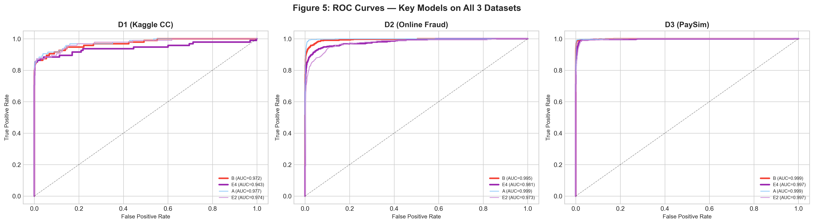
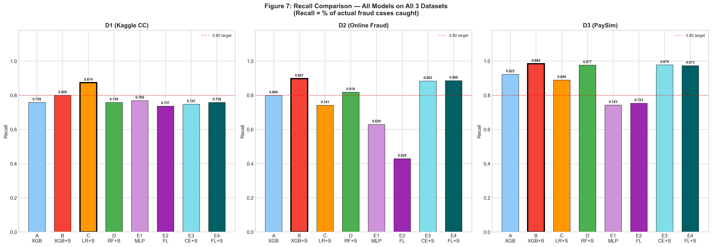
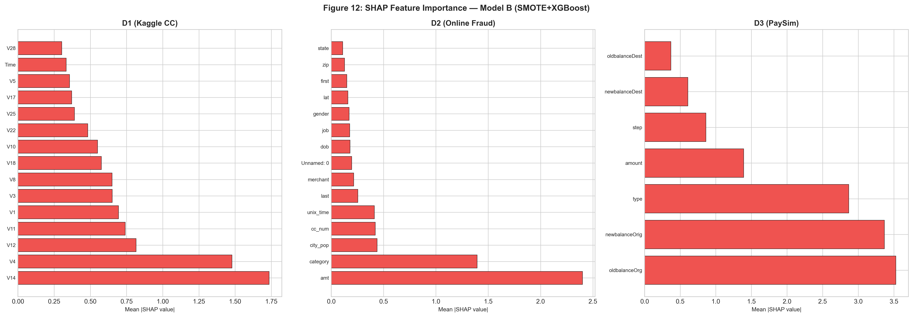

<div align="center">

# 🚨 Multi-Dataset Fraud Detection Benchmark

### Beyond Single-Dataset Evaluation:  
### A Benchmark of SMOTE, Focal Loss, and XGBoost for Explainable Fraud Detection

<br>


<br><br>

### 🔍 Explainable Financial Fraud Detection  
### ⚡ SMOTE + XGBoost + Focal Loss + SHAP + Statistical Validation

</div>

---

# 📖 Overview

This repository presents a comprehensive benchmark study for financial fraud detection across multiple datasets using machine learning and deep learning approaches.

The project evaluates the effectiveness of:

- SMOTE oversampling
- XGBoost classifiers
- Focal Loss for deep learning
- SHAP explainability
- Statistical significance testing
- Cross-dataset generalization

Unlike many existing studies that evaluate models on a single dataset, this benchmark investigates how fraud detection models behave across multiple fraud environments.

---

# 🚀 Key Contributions

✅ Multi-dataset fraud detection benchmark  
✅ Evaluation of SMOTE for imbalance handling  
✅ Deep learning with Focal Loss  
✅ Explainable AI using SHAP  
✅ McNemar statistical significance testing  
✅ Cross-dataset generalization analysis  
✅ Real-time latency benchmarking  
✅ Publication-quality visualizations  

---

# 📊 Datasets

| Dataset | Description | Fraud Cases |
|---|---|---|
| D1 | Kaggle Credit Card Fraud | 492 |
| D2 | Online Transaction Fraud | 1,716 |
| D3 | PaySim Mobile Money Fraud | 3,598 |

---

# 📥 Dataset Sources

## 🏦 Kaggle Credit Card Fraud Dataset

https://www.kaggle.com/datasets/mlg-ulb/creditcardfraud

---

## 🌐 Online Transaction Fraud Dataset

https://www.kaggle.com/datasets/kartik2112/fraud-detection

---

## 📱 PaySim Mobile Money Dataset

https://www.kaggle.com/datasets/ealaxi/paysim1

---

# 🧠 Models Evaluated

| ID | Model |
|---|---|
| A | XGBoost |
| B | XGBoost + SMOTE |
| C | Logistic Regression + SMOTE |
| D | Random Forest + SMOTE |
| E1 | MLP + Cross Entropy |
| E2 | MLP + Focal Loss |
| E3 | MLP + Cross Entropy + SMOTE |
| E4 | MLP + Focal Loss + SMOTE |

---

# 🏆 Experimental Results

## 🥇 Best Overall Model — SMOTE + XGBoost

| Dataset | Recall | ROC-AUC | PR-AUC | MCC |
|---|---|---|---|---|
| D1 (Kaggle CC) | 0.800 | 0.972 | 0.810 | 0.723 |
| D2 (Online Fraud) | 0.897 | 0.995 | 0.885 | 0.754 |
| D3 (PaySim) | 0.984 | 0.999 | 0.987 | 0.896 |

---

## 🧠 Best Deep Learning Model — MLP + Focal Loss + SMOTE

| Dataset | Recall | ROC-AUC | PR-AUC | MCC |
|---|---|---|---|---|
| D1 (Kaggle CC) | 0.758 | 0.943 | 0.789 | 0.701 |
| D2 (Online Fraud) | 0.886 | 0.981 | 0.778 | 0.450 |
| D3 (PaySim) | 0.973 | 0.997 | 0.961 | 0.784 |

---

# 🔍 Key Findings

- SMOTE significantly improved fraud recall across all datasets.
- XGBoost consistently achieved the best balance between recall, precision, and latency.
- Focal Loss improved deep learning performance on highly imbalanced fraud data.
- SHAP explainability revealed consistent fraud-related features across datasets.
- McNemar testing confirmed statistically significant improvements over baseline models.

---

# 📈 Performance Comparison

## Recall Comparison

| Model | D1 | D2 | D3 |
|---|---|---|---|
| XGBoost | 0.758 | 0.800 | 0.922 |
| XGBoost + SMOTE | **0.800** | **0.897** | **0.984** |
| Logistic Regression + SMOTE | 0.874 | 0.741 | 0.889 |
| Random Forest + SMOTE | 0.758 | 0.818 | 0.977 |
| MLP + CE | 0.768 | 0.629 | 0.743 |
| MLP + Focal | 0.737 | 0.429 | 0.753 |
| MLP + CE + SMOTE | 0.747 | 0.883 | 0.978 |
| MLP + Focal + SMOTE | 0.758 | 0.886 | 0.973 |

---

# ⚡ Deployment Analysis

## Training Time (seconds)

| Model | D1 | D2 | D3 |
|---|---|---|---|
| XGBoost | 8.4s | 7.8s | 3.4s |
| XGBoost + SMOTE | 15.6s | 14.1s | 6.4s |
| Logistic Regression + SMOTE | 2.4s | 2.3s | 1.2s |
| MLP + Focal + SMOTE | 1965.2s | 785.9s | 625.8s |

---

## Inference Latency (ms per sample)

| Model | D1 | D2 | D3 |
|---|---|---|---|
| XGBoost + SMOTE | 0.0058 | 0.0057 | 0.0052 |
| Logistic Regression + SMOTE | 0.0007 | 0.0004 | 0.0002 |
| MLP + Focal + SMOTE | 0.0150 | 0.0027 | 0.0075 |

---

# 📷 Example Visualizations

## ROC Curves



---

## Recall Comparison



---

## SHAP Explainability



---

# 🔍 Explainable AI (SHAP)

SHAP was used to identify the most influential fraud-related features.

## Important Features — D1

- V14
- V4
- V12
- V11

---

## Important Features — D2

- amt
- category
- city_pop

---

## Important Features — D3

- oldbalanceOrg
- newbalanceOrig
- type
- amount

---

# 📂 Repository Structure

```bash
multi-dataset-fraud-benchmark/
│
├── Datasets/
│
├── figures/
│
├── notebooks/
│
├── past paper/
│
├── results/
│
├── README.md
│
└── requirements.txt
```

---

# 📚 Literature Review

The repository also contains research papers used during the literature review phase.

Topics include:

- Fraud Detection
- XGBoost
- SMOTE
- Explainable AI
- Deep Learning
- Financial Analytics

Location:

```bash
past paper/
```

---

# 💻 Installation

## Clone Repository

```bash
git clone https://github.com/yourusername/multi-dataset-fraud-benchmark.git
```

---

## Install Requirements

```bash
pip install -r requirements.txt
```

---

## Launch Notebook

```bash
jupyter notebook
```

Open:

```bash
notebooks/fraud_detection_benchmark.ipynb
```

---

# 📦 Main Libraries

```python
pandas
numpy
scikit-learn
xgboost
tensorflow
torch
shap
imbalanced-learn
matplotlib
seaborn
scipy
```

---

# 📈 Evaluation Metrics

The project evaluates models using:

- Recall
- Precision
- F1 Score
- ROC-AUC
- PR-AUC
- MCC
- Accuracy

Primary metric:

> Recall — percentage of fraud cases correctly detected.

---

# 🔮 Future Work

Potential future improvements include:

- Graph Neural Networks
- Transformer-based Fraud Detection
- Federated Learning
- Streaming Fraud Detection
- Adaptive Concept Drift Handling

---

# 📄 Citation

```bibtex
@article{fraudbenchmark2026,
  title={Beyond Single-Dataset Evaluation: A Benchmark of SMOTE, Focal Loss, and XGBoost for Explainable Fraud Detection},
  author={Author},
  year={2026}
}
```

---

<div align="center">

# ⭐ Final Conclusion

## 🔥 SMOTE + XGBoost achieved the strongest balance between:

### Fraud Recall ⚡  
### Explainability 🔍  
### Real-Time Performance 🚀  
### Cross-Dataset Robustness 🌍  

<br>

### ⭐ If you found this project useful, consider starring the repository.

</div>
